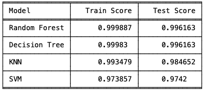
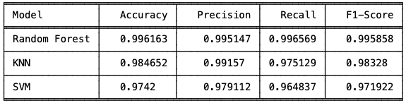

# ids-ibr

Network Intrusion Detection System (IDS) using KNN, RF, DT and SVM achieved 99.6% accuracy. With an inference web-app implemented using streamlit.

## Contacts

`Adedoyin Simeon Adeyemi` | [LinkedIn](https://www.linkedin.com/in/adedoyin-adeyemi-a7827b160/)

## Repo structure

- `model_dev`: [Model Development](https://github.com/SimeonDee/ids-ibr/tree/main/model_dev)
- `inference_app`: [Inference App](https://github.com/SimeonDee/ids-ibr/tree/main/inference_app)

## Sample Screenshots

- Evaluation on Train vs Test Datasets

  

- Models' Evaluations on Test sets

  
